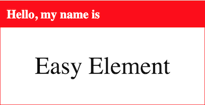
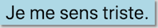

# Easy Element

Easily create web components (custom elements) from HTML, CSS, and [JavaScript classes](https://developers.google.com/web/fundamentals/web-components/customelements).

## Install

```bash
$ npm install -g easy-element

# or locally
$ npm install --save-dev easy-element
```

## Usage



For a purely visual element like this `<name-tag>` you can create one HTML file with only a `template` and a `style`.

```html
<!-- src/name-tag.html -->
<template>
  <h2 class="name-tag_heading">Hello, my name is</h2>
  <div class="name-tag_name-container">
    <slot></slot>
  </div>
</template>
<style>
  name-tag {
    border: 1px solid red;
    display: inline-block;
    width: 400px;
  }
  .name-tag_heading {
    background-color: red;
    color: white;
    padding: 0.5em;
    margin: 0;
  }
  .name-tag_name-container {
    background-color: white;
    padding: 1em 0.5em;
    font-size: 3em;
    text-align: center;
  }
</style>
```

Then on your command line, you can build the custom element for use in browsers.

```bash
$ easy-element build src/name-tag.html
```

It will create two JavaScript files: `dist/name-tag.es5.js` and `dist/name-tag.class.js` for old and new browsers respectively.

### In older browsers

To start using `<name-tag>` in older browsers install `@webcomponents/webcomponentsjs` for your project.

```bash
$ npm install --save '@webcomponents/webcomponentsjs'
```

Then include these scripts in your HTML.

```html
<script src="/node_modules/@webcomponents/webcomponentsjs/custom-elements-es5-adapter.js"></script>
<script src="/node_modules/@webcomponents/webcomponentsjs/webcomponents-loader.js"></script>
<srcipt src="/dist/name-tag.es5.js"></script>
```

### In new browsers

Just add the element's class-based script to your HTML.

```html
<srcipt src="/dist/name-tag.class.js"></script>
```

## Adding functionality

For components that _do_ stuff, you'll need some JavaScript. Here's a button that changes color when clicked.




We'll split it up into three files in our `src` folder.

```html
<!-- src/blue-button.html -->
<button><slot>Push this button!</slot></button>
```

```css
/* src/blue-button.css */
blue-button button {
  background-color: blue;
  border: 0;
  box-shadow: 2px 2px 2px gray;
  color: white;
  font-size: 1.5em;
}
blue-button.light button {
  background-color: lightblue;
  color: black;
}
```

```js
// src/blue-button.js
class BlueButton {
  connectedCallback() {
    this.querySelector('button').addEventListener('click', event => {
      this.classList.toggle('light')
    })
  }
}
```

Then it's built by running

```bash
$ easy-element build src
```

## Run

```bash
# Build from one source file, output to dist.
$ easy-element build src/my-element.html

# Build from one source file, output to public.
$ easy-element build --output public src/my-element.html

# Read .html, .css, and .js files from my-element-directory to build.
$ easy-element build my-element-directory

# Watch the src folder and re-build when its contents change.
$ easy-element watch src

# Create demo-page/index.html to show off my-element.
$ easy-element demo --output demo-page src/my-element.html
```

Files are output to a folder named `dist` by default. You can change this with the `--output` option, or `-o` for short.

For help, use the `--help` option.

## Browser Support

Tested with Chrome, IE 10, Edge, FireFox, and Safari.

## Transformations

### ES6

New stuff like `const`, `let`, `class`, and arrow functions are compiled down to ES5.

### :host

Shadow DOM has the concept of the "host" element. We don't support that in ES5-land because polyfills are slow. So when you have a CSS selectors that use `:host` ...

```css
/* my-element.css */
:host { ... }
:host(.enabled) { ... }
```

...they are converted to the following for the `.es5.js` output file.

```css
my-element { ... }
my-element.enabled { ... }
```

The reverse is true for the `.class.js` output file where Shadow DOM is a real thing. CSS selectors containing your custom element's name are transformed to use `:host` and `:host(...)` as necessary.

### Querying

`this.querySelector` and `this.querySelectorAll` are transformed into `this.shadowRoot.querySelector` and `this.shadowRoot.querySelectorAll` respectively in the class-based output.

# Intent

The goal of Easy Element is to allow creation of custom elements without worry about browser support while leveraging technologies web developers are already familiar with.

For example if web developers want to handle events within a custom element, they can do so using native JavaScript like `addEventListener`. Compare this to a library like [stencil](https://stenciljs.com/docs/events) where the developer is expected to import event-related decorators and learn to use a proprietary interface.

Easy Element is intended for simple custom elements. If you want something more complex, there are [more feature-complete libraries](https://www.webcomponents.org/introduction#libraries-for-building-web-components) out there.

Or you can use Easy Element as a starting point to build your custom element, then use the generated JavaScript in the `.class.js` file with other tools, as it is V1 spec compliant.

# Limitations

## Slots

Only one non-named `<slot>` element is supported on the ES5-side at this point. It may be enhanced to support named slots in the future.

## Shadow DOM

No attempt is made to polyfill shadow DOM for old browsers. The ES5 output will add your template's contents to the element's inner HTML, and your styles will be appended to `document.head`. So encapsulate your styles by starting your selectors with your element's tag-name or `:host` or use something like [BEM](http://getbem.com/).

The class-based output will use shadow DOM.
